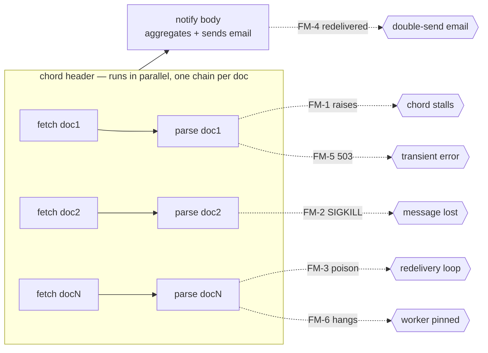

# reliable-celery-pipelines

A reference for building **fault-tolerant document-processing pipelines on Celery**, organized as a sequence of failure modes and the minimum-footprint patterns that neutralize each.

## The thesis

Celery's `chord` primitive looks like a clean fan-out/fan-in: run a header of N tasks in parallel, then run a body once they're all done. In practice it has a documented footgun: **if any header task fails (or crashes, or hangs, or is dead-lettered), the body never fires**. The pipeline stalls silently — no aggregation, no notification, no error visibility — until someone notices that yesterday's documents were never delivered.

In a fetch → parse → notify pipeline running across N documents per chord, this is the difference between "9 out of 10 docs processed and the user knows" and "the worker queue is healthy and nothing happened." Most teams hit this in production before they hit it in design review.

This repo walks through six concrete failure modes, each in its own runnable file, building from a naive baseline to a pipeline that survives header crashes, worker SIGKILLs, poison messages, duplicate notifications, transient downstream errors, and hangs — without giving up Celery's chord semantics.

## Topology and failure points



Each `X` is the moment the pipeline silently breaks. Each FM file fixes one of them without restructuring the chord.

## The failure modes

| FM | Symptom | Root cause | Fix | File |
|---|---|---|---|---|
| **FM-0** | Baseline: header raises, chord body never fires | Celery records FAILURE-state chord member → coordinator never dispatches body | (none — this is the bug) | [fm0_naive.py](fm0_naive.py) |
| **FM-1** | Same as FM-0, now fixed | Exceptions escape the task body and poison the chord | `@enveloped` catches everything and returns a `Result(status="FAILURE")` envelope — every chord member ends in Celery-state SUCCESS, body always fires | [fm1_mid_pipeline_error.py](fm1_mid_pipeline_error.py) |
| **FM-2** | Worker SIGKILL'd mid-task → message lost, chord stalls | Default `acks_early` acks at receipt; if the child dies, the broker has no idea | `acks_late=True` + `reject_on_worker_lost=True` → broker requeues; sibling worker picks it up. Requires `--concurrency=2` | [fm2_worker_crash.py](fm2_worker_crash.py) |
| **FM-3** | Poison message: always crashes → infinite redelivery → chord stalls | FM-2 has no upper bound on redelivery | RabbitMQ quorum queue with `x-delivery-limit` + DLX/DLQ → broker dead-letters after N tries. Beat task `drain_dlq` writes a **SUCCESS-state `Result(status="FAILURE")`** via `mark_as_done` so the chord coordinator advances normally | [fm3_dlq_reconciliation.py](fm3_dlq_reconciliation.py) |
| **FM-4** | `notify` runs twice → user gets two emails | `acks_late` is at-least-once; redelivered chord bodies fire twice | Redis SETNX lock keyed by `pipeline_id`: first claim wins and sends; concurrent claim busy-retries; post-send claim short-circuits | [fm4_duplicated_runs.py](fm4_duplicated_runs.py) |
| **FM-5** | Downstream service returns 503 → doc fails terminally | Naive: any exception is fatal. FM-1 wraps it but doesn't retry | `@transient_retryable(exceptions=(TransientServiceError,), max_retries=3)` between `@enveloped` and the body: exponential backoff + jitter, re-raises on exhaustion so `@enveloped` envelopes it | [fm5_transient_failures.py](fm5_transient_failures.py) |
| **FM-6** | Task hangs (no exception, no exit) → worker slot pinned forever, chord stalls | Celery's own `time_limit` calls `mark_as_failure` unconditionally on timeout (`celery/worker/request.py:521-538`) → FAILURE-state chord member → ChordError. Unlike `on_worker_lost`, there's no `if not requeue` guard | `@hard_timeout(seconds)` raises `HardTimeoutExceeded` from inside the body via `signal.setitimer(ITIMER_REAL)` → SIGALRM → `@enveloped` catches it → SUCCESS-state FAILURE envelope. Celery's `time_limit` stays as a backstop | [fm6_task_timeouts.py](fm6_task_timeouts.py) |

The reasoning behind FM-3's "SUCCESS-state FAILURE envelope" and FM-6's `mark_as_done`-not-`mark_as_failure` distinction is the load-bearing insight that makes the chord coordinator cooperate; see the docstrings in those files for the Celery-internals citation.

## Shared primitives

Three small pieces of machinery do most of the work, defined in [shared/](shared/):

**`@enveloped`** ([shared/decorators.py](shared/decorators.py)) — outer decorator. Wraps the task body so every exit (success, raised exception, retry exhaustion, hard timeout) becomes a `Result[T]` dict. The chord coordinator never sees a FAILURE-state member; the body always fires. `Retry` is the one exception that must propagate to Celery — re-raised explicitly.

**`@transient_retryable(exceptions=..., max_retries=...)`** ([shared/decorators.py](shared/decorators.py)) — inner decorator. Catches the named exception classes, schedules `self.retry()` with exponential backoff + jitter, re-raises the original on exhaustion. The re-raise is critical: it gives the outer `@enveloped` a chance to convert it to a FAILURE envelope rather than killing the chord.

**`Result[T]`** ([shared/result.py](shared/result.py)) — typed envelope (`status`, `payload`, `error`, `attempts`). Serialized to a plain dict for Celery's JSON backend; reconstructed at the boundary with `Result.from_dict(raw, PayloadType)`. A `TYPE_CHECKING`-only `SuccessResult[T]` subclass plus `TypeIs` narrowing in [shared/fm_asserts.py](shared/fm_asserts.py) lets us guarantee `payload` is non-None after `assert_fm1_chord_body_fired(...)` without runtime cost.

### Stacking order matters

```
@app.task(bind=True, acks_late=True, reject_on_worker_lost=True, ...)
@enveloped                       # FM-1: convert every exit to Result[T]
@transient_retryable(...)        # FM-5: bounded retries on transients
@hard_timeout(seconds)           # FM-6: SIGALRM-based per-body deadline
def parse_document(self, ...): ...
```

`@enveloped` must be outermost: `@transient_retryable` re-raises on exhaustion, and that re-raise must be caught and enveloped, not escape the chord member. Swap the order and you either eat the `Retry` signal (silently disabling retries) or let exceptions escape (breaking FM-1).

## Quickstart

```bash
docker-compose up -d                       # RabbitMQ + Redis
python run_all_fms.py                      # the test suite — runs FM-1..FM-6 end-to-end
```

`run_all_fms.py` is the de-facto integration suite: it resets Redis and RabbitMQ between FMs, spawns a worker subprocess with the right flags per FM, polls for readiness, runs the pipeline, and applies cumulative assertions (FM-6 also verifies FM-1..FM-5 still hold). Flags: `--only fm3 fm6` for a subset, `--include-fm0` to also run the broken baseline (it will stall — that's the point), `--down` to tear the stack down.

To run a single FM:

```bash
docker-compose up -d
celery -A fm5_transient_failures worker --loglevel=info --concurrency=2 --beat
python fm5_transient_failures.py
```

Each FM file's docstring documents its exact worker flags and what it proves.

## Tradeoffs and limits

These patterns work, but none of them are free. Before adopting any of them in your own pipeline, know what they cost:

- **At-least-once is now your contract.** `acks_late` + redelivery means every task body must be idempotent or wrapped in an idempotency primitive (which is why FM-4 exists). FM-4's Redis lock is per-`pipeline_id` and application-level — it does **not** idempotize the downstream email API. A crash between `send_email()` and `mark_sent()` will resend. End-to-end exactly-once requires the downstream to honour an idempotency key.
- **`@hard_timeout` is Linux/Unix only.** It uses `signal.setitimer(ITIMER_REAL)` + `SIGALRM`; Windows workers will not honour it. Celery's `time_limit` stays in as a cross-platform backstop, but it poisons chords (FM-6), so on Windows you'd need a different strategy.
- **DLQ drain interval is your latency floor for poison resolution.** With `DRAIN_INTERVAL_SECONDS = 5` a poisoned chord member stalls the body up to 5s past the broker's final redelivery. In a network partition the DLQ can accumulate a backlog the chord coordinator can't see until drain catches up.
- **`Result(status="FAILURE")` hides the *kind* of failure.** A header crash, an exhausted retry, a hard timeout, and a DLQ-finalized poison all show up as the same envelope shape. For ops you probably want a `reason: Literal["header_crash", "retries_exhausted", "timeout", "dlq"]` field so dashboards can split them.
- **No backpressure on the chord header.** Submitting 10k documents as one chord will overwhelm RabbitMQ's coordinator state and the result backend. Use `chunks()` / `group(...).chunks()` and a meta-chord pattern for anything beyond a few hundred members.
- **No observability layer included.** In production you'd want: a Prometheus counter on `Result.status="FAILURE"` partitioned by `reason`; a gauge on DLQ depth; a histogram on `attempts` per task; an alert on `drain_dlq` last-run age. None of this is in the repo — the point here is the patterns, not the dashboards. But shipping any of this without those metrics means flying blind.

## Would you actually use Celery for this?

Honest answer: probably not, if you're starting from scratch.

| Alternative | Where it beats Celery + these patterns | What it costs |
|---|---|---|
| **Temporal** | Durable execution, native fan-out/fan-in, retries and timeouts as first-class workflow primitives. Most of FM-1..FM-6 collapse into framework features you'd otherwise reimplement. | Operational footprint of running a Temporal cluster; Python SDK is younger than Java/Go. |
| **Dagster / Prefect** | Document pipelines map naturally to DAGs of assets; built-in retries, observability, lineage. | "Data engineering" framing; less natural for low-latency request/response work. |
| **AWS Step Functions** | If you're on AWS: native fan-out (`Map` state), retries, catch, DLQ. FM-3 and FM-5 disappear. | Vendor lock-in; awkward to test locally; per-transition cost at scale. |
| **Kafka + a stream processor** (Faust, kstreams, Quix) | If documents arrive as a stream and "notify" means "emit on aggregation". At-least-once with offset commits is well-understood. | No native chord/fan-in; you implement key-windowed aggregation yourself. |
| **Plain RabbitMQ + an explicit state machine in Postgres** | When you want full control over state transitions and visibility, and `chord` is more abstraction than you actually need. | You build retries, timeouts, DLQ wiring, idempotency yourself — i.e. the things this repo demonstrates with Celery. |

**Recommendation: for new pipelines, default to Temporal.** Use Celery only when it's already in your stack and replacing it would cost more than absorbing the patterns in this repo. The work here is what "absorbing the patterns" actually looks like.

## Out of scope

Things this repo deliberately does not address, because they're large enough to deserve their own treatment:

- Multi-region pipelines and cross-region broker replication
- Strict exactly-once semantics (only at-least-once + idempotency)
- Strict ordering between docs in a chord
- Backpressure and admission control for very large chords (10k+ docs)
- Autoscaling worker fleets based on queue depth
- Secrets management, deployment topology, broker HA

## Repo layout

```
fm0_naive.py                  # broken baseline (FM-1 on display)
fm1_mid_pipeline_error.py     # @enveloped
fm2_worker_crash.py           # acks_late + reject_on_worker_lost
fm3_dlq_reconciliation.py     # quorum queue + DLQ + drain beat task
fm4_duplicated_runs.py        # Redis SETNX idempotency lock
fm5_transient_failures.py     # @transient_retryable
fm6_task_timeouts.py          # @hard_timeout via SIGALRM
run_all_fms.py                # end-to-end harness / test suite
shared/
  decorators.py               # @enveloped, @transient_retryable
  result.py                   # Result[T] + payload dataclasses
  dlq.py                      # DLQ topology + drain_dlq_messages
  idempotency.py              # NotifyCoordinator + send_email stub
  counters.py                 # Redis attempt tracking
  flake.py                    # FAIL / CRASH_ONCE / POISON / ... sentinels
  fm_asserts.py               # typed cumulative assertions with TypeIs
  redis.py, wait.py           # tiny helpers
docker-compose.yml            # RabbitMQ + Redis
pyproject.toml                # Python deps (celery 5.5.3, celery-types, pyright)
```
